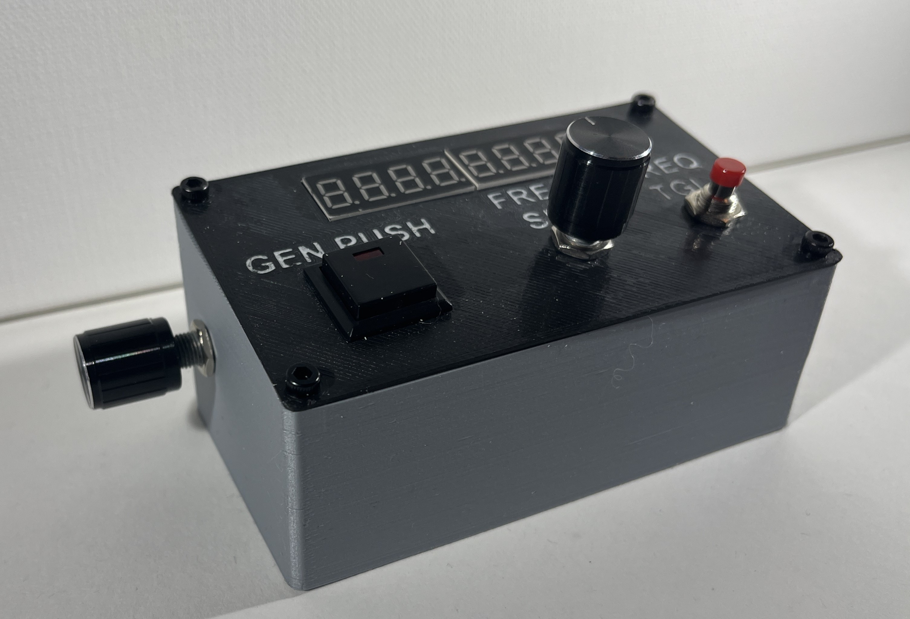
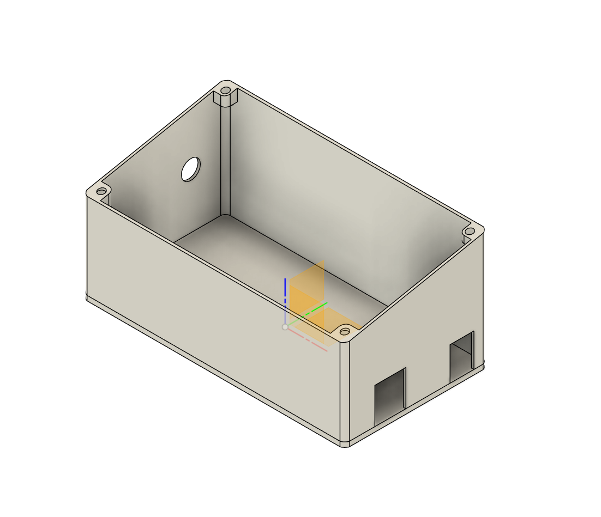
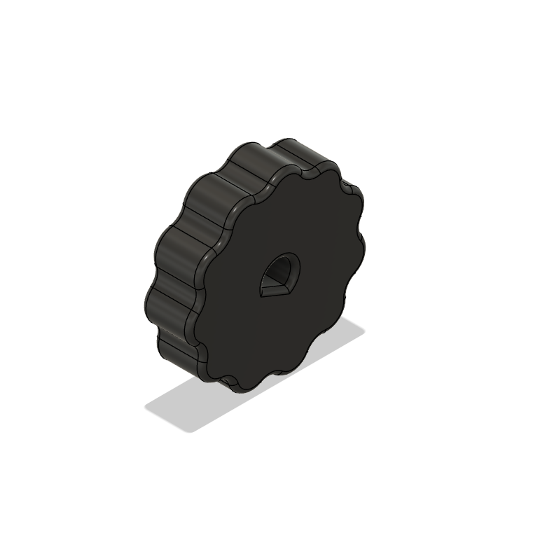
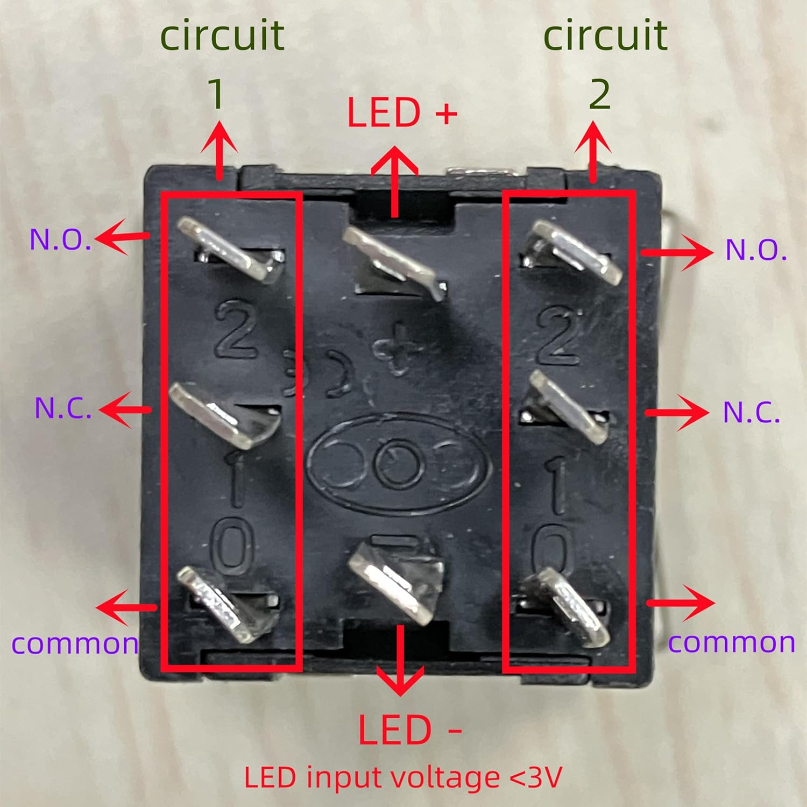

# 📡 VHF Panel

A simple and efficient **VHF Panel** designed for use on the **VATSIM Network** with an **Arduino Mega** and **Mobiflight**. It utilizes common, easily accessible components and is wired with **Dupont connectors** for straightforward assembly.

## ⚙️ Features  

- **Displays standby frequency on an 8-digit 7-segment display**
- **Single rotary encoder knob:** (Supports both single and double encoders)
  - Integrated button allows switching between large and small frequency increments
- **Generic KD22 push button:** Can be assigned to any custom function
- **Frequency toggle button:** Quickly switch between active COM1 and standby frequencies
- **Side-mounted digital encoder:** Designed for use as a trim control

## 🛠️ Materials Used  

- **Arduino Mega R3 (25 Euro)**  
  [Available on Amazon](https://www.amazon.de/-/en/dp/B09F9VJBZX?_encoding=UTF8&psc=1)

- **7-Segment Display 3-Pack (10 Euro)**  
  [Available on Amazon](https://www.amazon.de/-/en/AZDelivery-MAX7219-TM1637-Compatible-Raspberry/dp/B07Z7RHD2J)

- **Rotary Encoders 5-Pack (10 Euro)**  
  [Available on Amazon](https://www.amazon.de/-/en/KY-040-Encoder-Automotive-Electronics-Multimedia/dp/B09726Y8RB)

- **Push Button 30-Pack (10 Euro)**  
  [Available on Amazon](https://www.amazon.de/-/en/RUNCCI-YUN-Pieces-Momentary-Button-Railway/dp/B08P4DD2BP)

- **KD-22 Illuminated Non-Locking Switches 10-Pack (12 Euro)**  
  [Available on Amazon](https://www.amazon.com/Locking-Button-Switch-19x19mm-Illuminated/dp/B07CXN14QV?th=1)

- **8 Pieces M3 Bolts (+-8 mm)**
- **220 Ohm Resistor**
- **M3 Washers:** May not be necessary depending on M3 screw size
- **3D Printed Parts**

### Total Costs  
- **Total Project Cost (Only using quantity of components required): 34 Euro**  
- **Total Project Cost (Total Cost for all components): 67 Euro**

## 🖨️ 3D Printed Housing  

The enclosure is thoughtfully designed for easy 3D printing on an **Ender 3** printer. The **STL folder** includes three essential files:  

- **Main enclosure**
- **Top panel**
- **Optional rotary encoder knob**

  
  
  

Achieving the perfect fit for the rotary encoder might require some fine-tuning. We recommend adjusting the **print size by 1-2%** up or down and testing multiple versions to ensure an optimal fit.

## ⚡ Electronics  

Most components, such as the **7-segment display** and **rotary encoders**, can be directly connected using their respective PCB pins. However, the **KD-22 switch** and **momentary switch** will require some soldering to function properly.

Below is the wiring diagram I created. It's my first time, so apologies if some of the correct conventions aren't followed - please provide feedback to improve this.

The KD-22 switch wiring can be tedious, and the guides I found online were hard to understand. Below is an image of the best one I could find. What I did in my design is bridge the common and LED `-` pins and have the `+` for the LED and switch on two separate pins.

### 📌 Notes  

- The connections to the **KD-22 switch** are exposed; ensure you use **heat-shrink tubing** or **electrical tape** to insulate them.
- The **Arduino Mega** (at least the model used here) doesn't have enough **VCC** or **GND** pins for every component. Daisy chaining with Dupont connectors isn't ideal. A simple solution is to create **Y-splitters**.

## ⚙️ Mobiflight Setup  

Mobiflight setup is straightforward:  

1. **Load the Arduino Mobiflight Module Config** first.  
2. Then load the **.MCC file**.  

The **.MCC configuration file** is optimized for MSFS 2020. Different bindings may be needed for other simulators.  

- [Mobiflight Arduino Mega Module Config](https://github.com/MWelding/VHFPanel/blob/main/Arduino%20mega%20Mobiflight%20Module%20Config.mfmc)  
- [Mobiflight VHF Panel Configuration File for MSFS 2020](https://github.com/MWelding/VHFPanel/blob/main/VHF%20Panel%20MB%20Config.mcc)

## Thank You!

Thank you for taking the time to review my project. This is my first electronics project, and I’ve tried to ensure every detail is covered. Any feedback or suggestions for improvement would be greatly appreciated!
 
