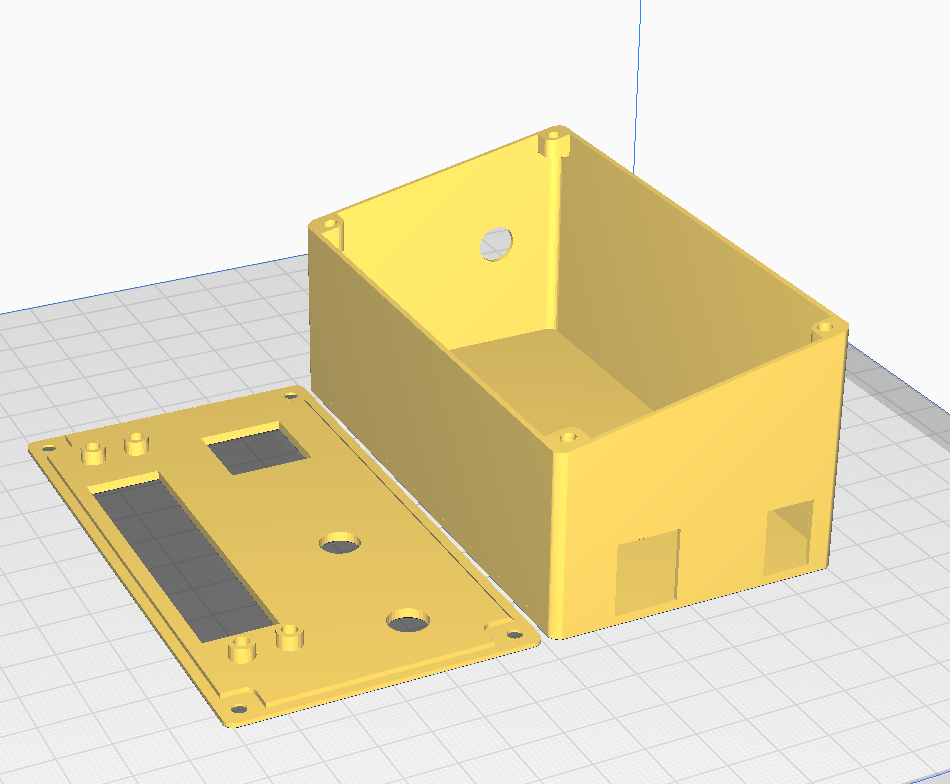

# VHF Panel
Welcome to the VHF Panel project repository! This is my first venture into the world of electronics, and the aim of this project is to streamline communications on the VATSIM network. By integrating MobiFlight, we make it possible to easily tune frequencies while flying, embodying the mantra "aviate, navigate, communicate" – allowing you to achieve two at once. 

## Features  
- **Shows standby frequency on 8 digit 7 segment display**

- **Single knob rotary encoder:** (Can use a single or double encoder)
  - Uses in-built button to change between large and small increments
  
 - **A generic push button using KD22 switch** - can be assigned to anything you would like

-  **Frequency toggle button** - for switching between the active COM1 and Standby frequencies

- **Side mounted digital encoder** - used as a trim

## 3D Printed Housing
I designed the enclosure to be easily 3D printen on my Ender 3. The STL's folder contains three files - the main enclosure, top panel and an optional trim rotary encoder knob.

  
  
  

